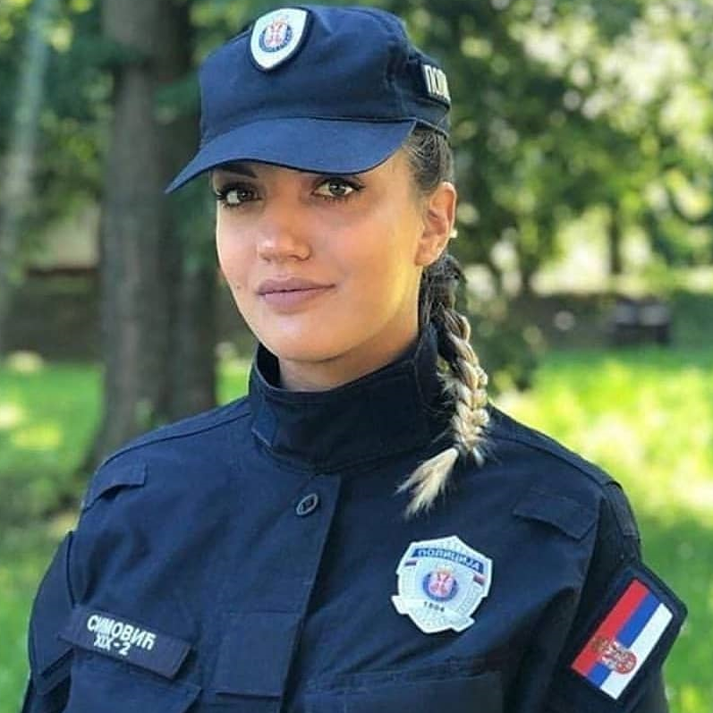
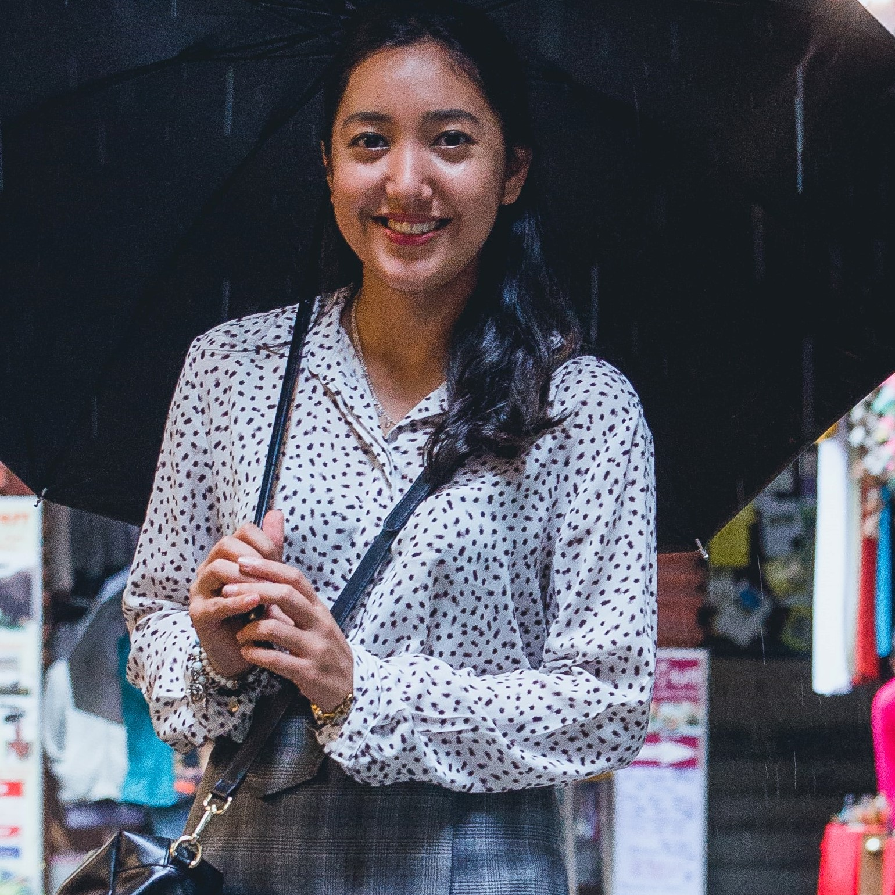
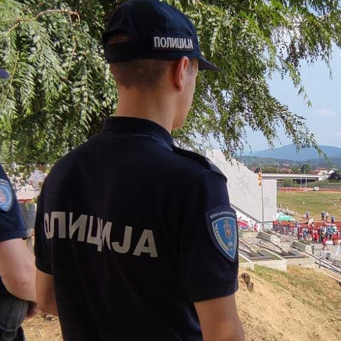
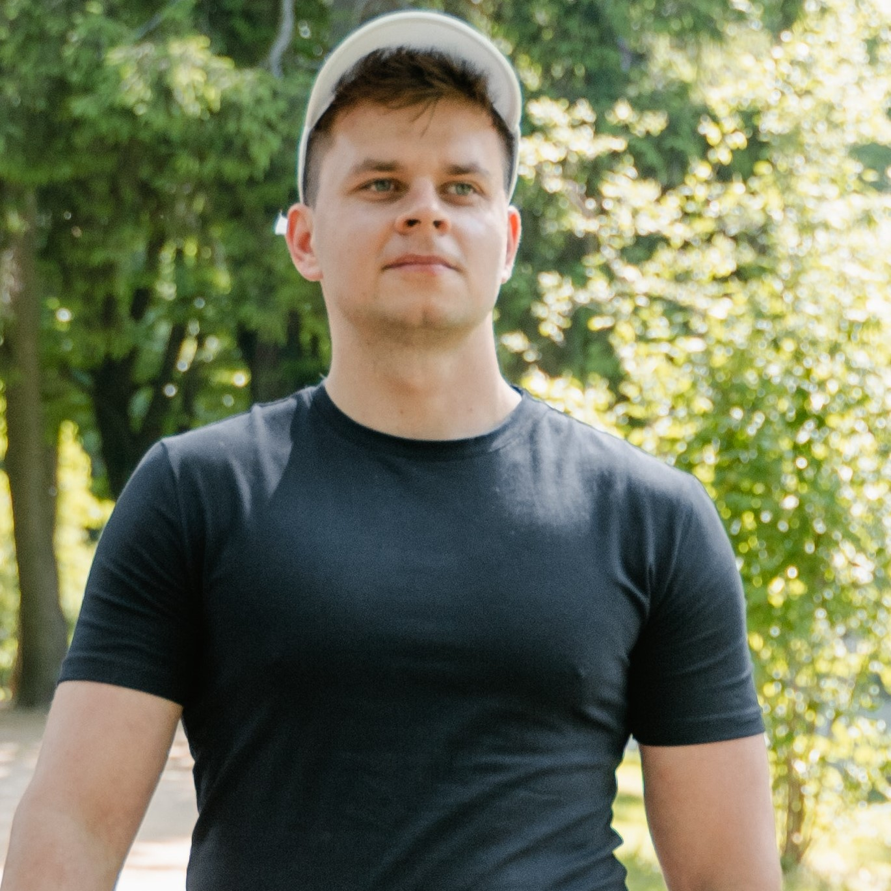
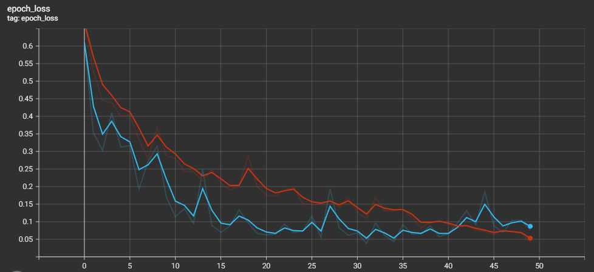
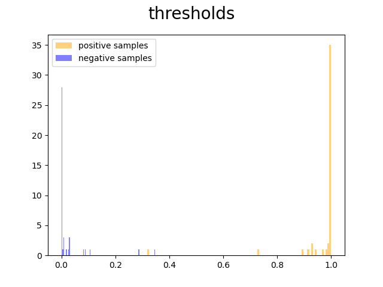
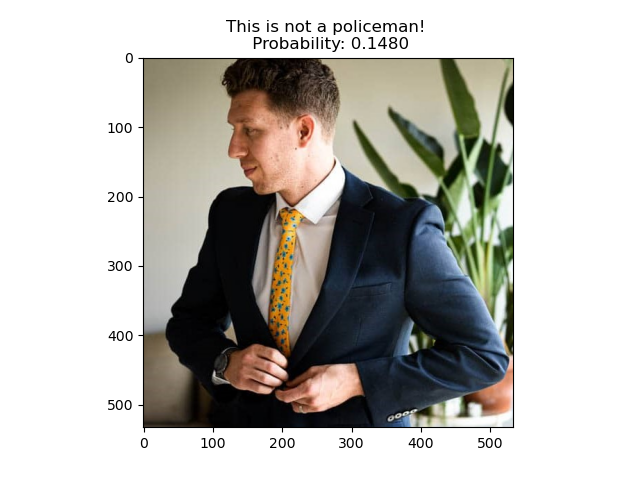
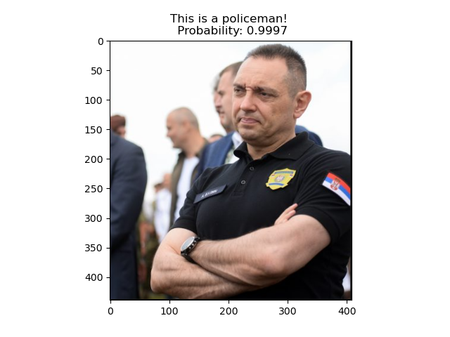

<div align="center"> <h1> Policemen vs Civilians </h1> </div>
<div align="center"><a>Jovana&nbsp;Gentić</a></div>
<br>
<br>

"Policemen vs Civilians" is an image classification model. We Convolutional Neural Networks (CNN) to learn a binary classification on a small dataset (<400 samples) of both Serbian policemen and civilians. This repo is written in Tensorflow.

<div class="row" align="center">
  <div class="column">
    
    
  </div>
  <div class="column">
    
    
  </div>
  <div class="column">
    
    
  </div>
  <div class="column">
    
    
  </div>
</div>

# Model Training
### Running the code
To train the model, we used VScode and we executed `code/train.py`. 

**Note:** If training more than one model, you should change the paths in lines 22 & 23 of `code/train.py`.

### Looking at metrics
After training a model, to look at the loss and metric curves, open an Anaconda terminal and type:

```
cd path/to/policemen_vs_civilians
tensorboard --logdir tb_logs
```

In your browser, go to `localhost:6006` to see the tensorboard UI.

<div align="center"></div>

# Model Evaluation
To evaluate the performance of the model on the validation data, start by changing the model path to the desired model to evaluate in line 9 of `code/evaluate.py`.

Then, execute `code/evaluate.py`. The code will plot the model probabilities on the validation data. Based on that figure, decide on a threshold to use for Accuracy, Precision and Recall metrics.

<div align="center"></div>

# Testing the model on new images
The model can be used on completely new images (even user provided).

The images to be tested on need to be square shaped. In our experiments, we cropped images to make them squared, with focus on the upper body of the person in the image.

All images that you want to test on, need to be placed inside the folder `testpics`.

To start, change the model path to the desired model in line 9 of `code/inference.py`. The code will ask for a model threshold to use to make the classification decision, and it will ask for images to be tested one by one.

Positives are policemen (label = 1) and negatives are civilians (label = 0).

<div align="center"></div>
<div align="center"></div>
